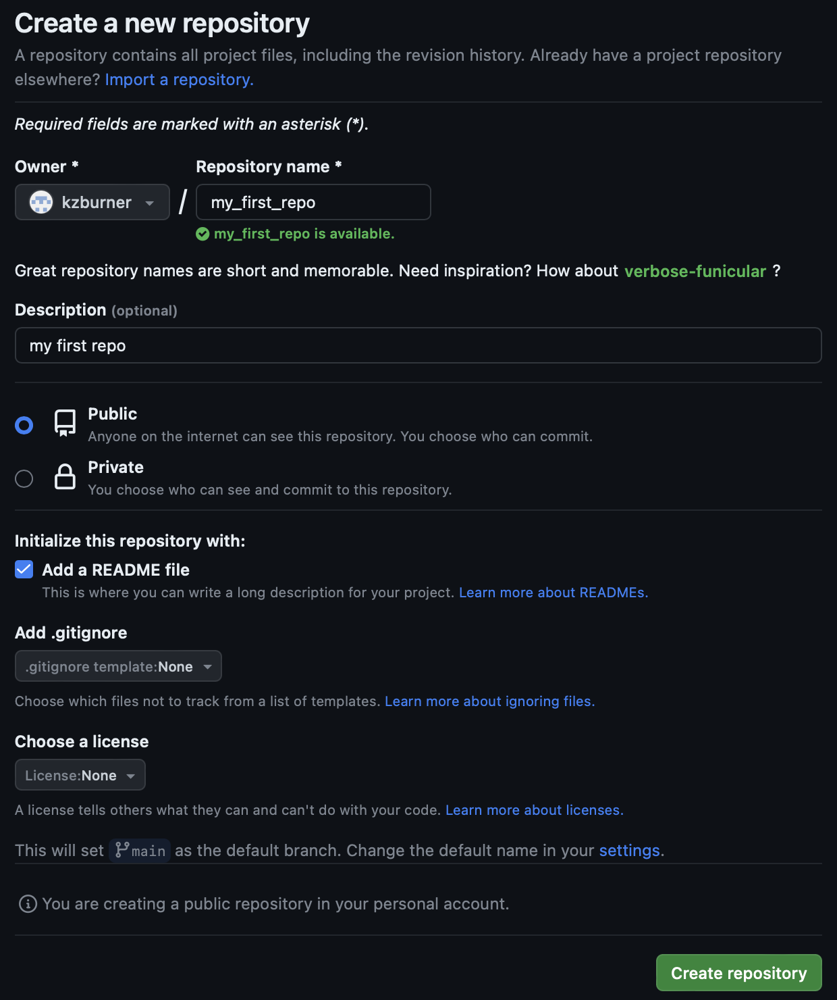
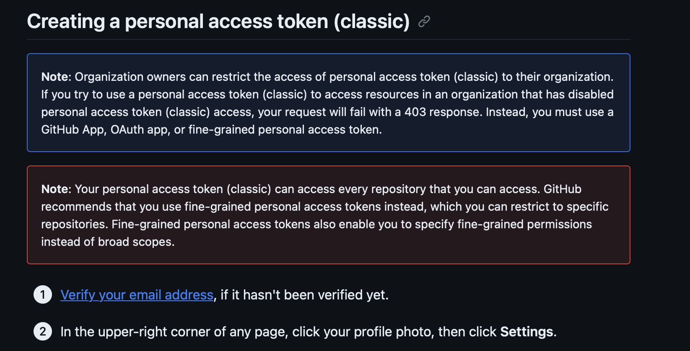
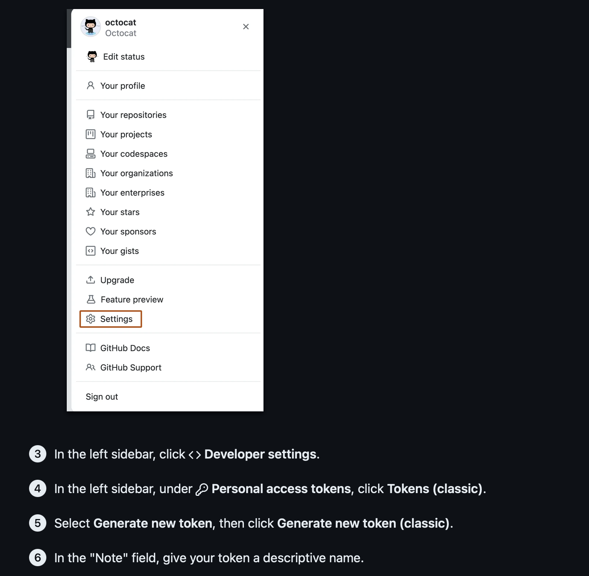
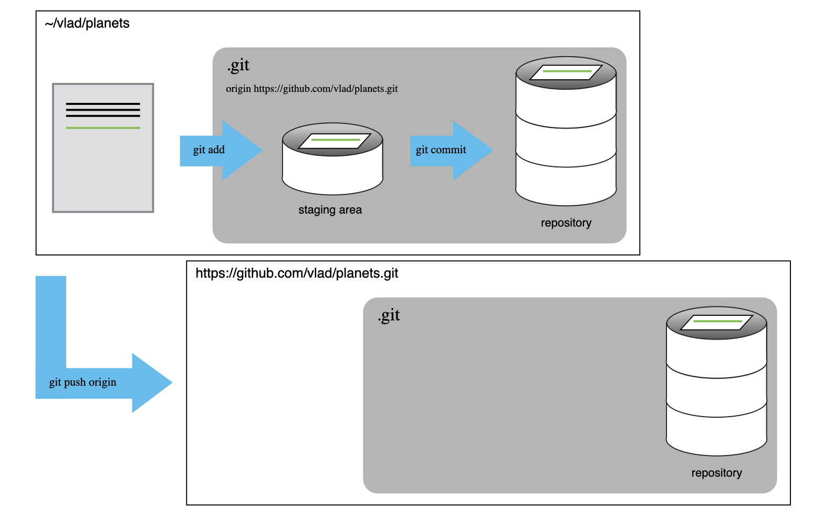
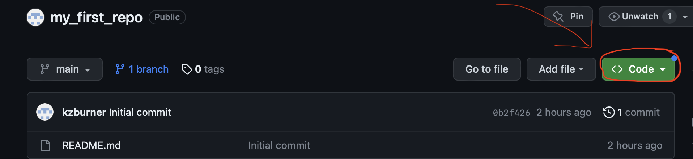
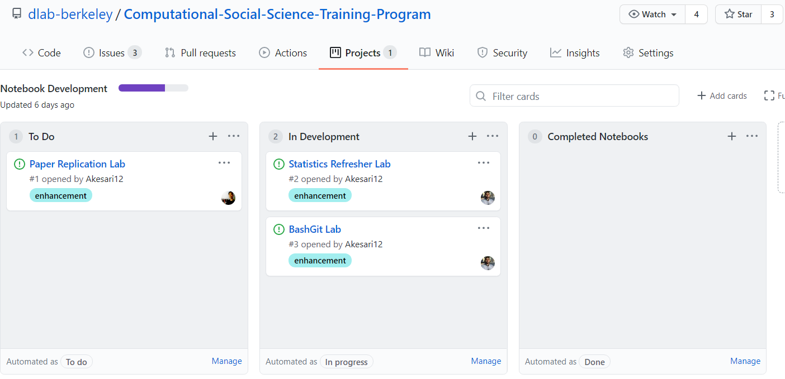

# [Computational Social Science] 
## 1-3 GitHub Intro


# Introduction to GitHub

Throughout this course, we'll be using a platform called [GitHub](https://github.com/). GitHub is a popular code hosting platform. It has lots of features that make version control and collaboration easier. Version control refers to the techniques for managing changes to software and code, and easily going back and forth between older and new versions of a code base. Getting familiar with GitHub and all of its tools can take some time, but the benefits for open science and streamlined collaboration are worth it.

At some point in your career, you have probably found yourself in a situation like this:


GitHub is a useful tool because it removes a lot of the obstacles that we usually face when we are collaborating with others. Instead of saving multiple versions of the same document, **GitHub lets us iterate on the same document while recording how it has changed over time. Rather than sending collaborators messily named documents, everyone can work from the same GitHub repository.** GitHub also has tools for resolving editing conflicts between collaborators and creating a clear workflow.

# Getting Started

First, let's get started by making GitHub accounts. Navigate to GitHub's [homepage](https://github.com). Navigate to "Sign Up" in the top right hand side of the page. Follow the prompts, they should be self explanatory.


I recommend you create an account using your berkeley.edu account. I'd also reccomend using an easily idenitfiable and memorable name as your username. For example, I used a concatenation of my name: `kaseyzapatka`. You'll need to verify your account by playing a game. Let's take a few mins to create accounts.

After today's lab, I recommend you head over to GitHub Education and follow the instructions for activating your [free student developer pack](https://education.github.com/pack/offers). The student developer pack is free for as long as you are a student, and offers a lot of [great benefits](https://education.github.com/students). You might also consider exploring some of the other benefits like access to cloud services like Amazon Web Services or Microsoft Azure. 

# Navigating GitHub

## Interacting with Other Repos

GitHub is built on top of [git](https://en.wikipedia.org/wiki/Git), which is a Linux-based version-control system. Git is used by software engineers and data scientists to track changes in code and other files, work together, and support distributed workflows. GitHub builds on top of the core toolkit by providing a suite of tools and graphical interfaces that streamline collaboration and code organization. Let's take a look at some of the features on the webpage. The first thing we will look at is how to interact with other users' repositories. Follow along by navigating to the GitHub repo for the [Computational Social Science](https://github.com/dlab-berkeley/Computational-Social-Science-Training-Program) course. 


There are three basic ways you can interact with someone else's repo:

- **Watch**: Notify you via email when there are changes or conversations in the repo.
- **Star**: Add this repo to a list of repos that appear in your feed. Think of this as "favoriting" a repo.
- **Fork**: Make a copy of this repository in your own account. This is useful if you are not directly involved with a project but want to build on top of someone else's code.

GitHub can be a great resource because it provides access to the world's largest collection of source code, and it hosts many open source projects. Depending on your field, there may already be lots of repositories available that are worth exploring. Try to do the following steps:

1. Find the search bar in the top right.
2. Search for repositories based on some key words that are common for your field. For example, try searching "health determinants", "economics", or "sociology". 
3. Star and/or fork a repository that you find.

You can also follow specific users to see all of the repositories associated with them. This is a great way to see what others are working on and keep up to date with new developments. For example, try navigating to [Kasey's homepage page](https://github.com/kaseyzapatka) and following it. 

## Create Your Own Repo

Next, let's look at how to make your own repos. Over time, you will create new repos to host code for your projects and collaborations. Doing so will help others reproduce your code, and serve as a useful way to showcase your work to employers and other social scientists. From the GitHub homepage, look for the "New" button near the top left. If this this is your first repo, the green button might say "Create repository" instead.


Once you do this, click the green button, then name your new repository "my_first_repo". 

- Add a short description of what this repo is. You can say something like: "My first practice repo." This will appear as text in the README file that we'll create in a later step.
- You can choose to make it public or private. Public repos can be seen and copied by anyone with a GitHub account; private repos cannot. Go ahead and leave it as public, which is the default. 
- Make sure you click the box to initialize it with a README.md file. It is best practice to always have a README file that explains what the repository is for. For now, you can ignore adding a .gitignore file and choosing a license. 
- Go ahead and click the green "Create repository" button at the bottom. 

The process should look something like this: 

 


## Generating a Personal Access Token (PAT)

In the next step, we will pull down (clone) an repo from GitHub to our local computer via the command line. There are two main ways to do this: using either an `https` or `ssh` protocol. A `https` protocol is a simple way to clone a repo by directing Git to the online GitHub web address and then pulling the contents of the repo down to your local machine. A `ssh` (secure shell protocol) is a more secure method because it uses a more complicated encription process. For now, `https` is sufficent for our purposes; however, you might need to use `ssh` in the future if you work on a project with secure data. Feel free to set up `ssh` on your local at a later time. The process involves two steps:  

- [Generating new SSH key](https://docs.github.com/en/authentication/connecting-to-github-with-ssh/generating-a-new-ssh-key-and-adding-it-to-the-ssh-agent)
- [Adding SSH Key](https://docs.github.com/en/authentication/connecting-to-github-with-ssh/adding-a-new-ssh-key-to-your-github-account) to your account. 

For class today, let's focus on using a `https` protocol. In the past, the `https` protocol has relied on users using their GitHub passwords to authenticate their individual computer to the GitHub repo. However, as of 2021, that process was superseeded by the use of a Personal Access Token (PAT) instead of your user password. Essentiallly, PATs are encripted tokens that are more secure than a user-generated password that essentially authenticates the compupter or user with GitHub.

Now there are two types of PATs of August 2023. The first is a classic PAT. **This is what we will be using**. The second is called a fine-grained PAT. The main difference is that you can set limits on the fine-grained PAT to specify which or which type of repos you can access and you can set an expiration date. This is helpful in that if there is a security breach or key is accidently shared, it will be easy to secure your account and your repos. GitHub reccomends using the fine-grained PAT for these reasons. However, it is still in beta and is prohibitively secure for our purposes in the course. So, we'll stick with the classic version, but feel free to update this at a later date. Here is a [blog-entry from GitHub](https://github.blog/2022-10-18-introducing-fine-grained-personal-access-tokens-for-github/) about the differences between these two types of PATs. 


### Generating a Classic PAT

Let's go ahead and generate a classic PAT. Here a helpful tutorial for [managing your personal access tokens](https://docs.github.com/en/authentication/keeping-your-account-and-data-secure/managing-your-personal-access-tokens). Make sure that you: 

- Create a classic PAT, not a fine-grained PAT
- Make sure to set no expiration date. GitHub recommends against this, but you can change these settings latter. While I normally advocate for best practices, I don't want to create any headaches for us later. 
- When you reach the "Select scope" step, make sure to select all of the following so that you won't have any problems in the course: 
	- “Repo”
	- “Workflow”
	- “User”
	- “delete_repo”
- Finally, **be sure to copy the token because we will use that as our new password in a few steps and you will not be able to see this again**. If you make a mistake, you will need to delete the PAT and start over. 

Let's follow these steps carefully: 


 


 


 


# Git from Command Line

Now that we have created a GitHub reposoitory online, we want to pull it down to our local computer so that we can work with it. This is the most common workflow. However, sometimes you might have already created a repo on your folder that you want to tract with git and store the code on GitHub. Here is a [link outline the steps](https://docs.github.com/en/migrations/importing-source-code/using-the-command-line-to-import-source-code/adding-locally-hosted-code-to-github), which is basically the reverse of what we are doing now. 

## Configure Credentials

Now we will see how to use some of git's core functions to work with repos and use version control. Before we start that, let's make sure to configure our global options for GitHub so that we don't have to login every time you want to do something. Open a bash terminal and run each line of code separately, substituting the GitHub handle and username you just created:

```
git config --global user.name "Your Username"
git config --global user.email "your.email@berkeley.edu"
```

Then to make sure you only need to type in your password once, run the following:

```
git config --global credential.helper cache
```

## Basic Workflow

First, we'll go through working with your own repository on your own. Some key terms:

- **Clone**: Download and copy a remote directory to a newly created folder on your machine. 
- **Status**: This is a reccomended step that shows you the status of tracked and untracked files. 
- **Add**: Stage changes you made to different files to get them ready to be uploaded back to the remote repository.
- **Commit**: Add a message to describe the changes that you have made.
- **Push**: Upload your changes.

You only clone a repo once. After that, add, commit, and push are the key steps, checking your status as necessary. Here is a visualization of the process: 

 

### Git Clone

Let's start by cloning the repository that you just created. Navigate to your repo's page, and find the green "Code" button.

 

Click the button, and then copy the HTML link that is displayed. Make sure the `HTTPS` tab is highlighted. Now, we'll want to clone this repo to a specific location on our local computer. Remember as we talked about last week, file organiztion is really important and will save you headaches later. My suggestion is that you navigate to your home directory (simply open the terminal or GitBash) and create a directory named `git` to house all of the directories you will push to GitHub. 

- The advantage to this organizational approach is that it will be easy to access GitHub directories from the command line since they will be located in a sub-directory of your home folder. For the course, it will also make it easy to start up `jupyter notebooks` if you clone the course repo here (I strongly advocate for this). 
- The disadvantage to this is that the folder will likely not be tracked by iCloud, Dropbox, Google Drive, etc. This is fine for this semester, and remember GitHub functions as a sort of cloud storage. 

My own protocol is to locate all GitHub tracked projects as described above but locate repos for academic papers and projects in my iCloud folder so that I can switch back and forth between computers and so they are always tracked by iCloud. So, take a minute to choose where you will locate your repo and then run the following code in your terminal (substitute your link for the one here):

```
git clone https://github.com/your-repo-name-here.git
```

### Git Add

Running this command in your terminal should create a folder in your current directory with the contents of your repo. Now let's practice adding content and updating the repo. Open the README.md file and add a short description of the repo (you can do this either from command line or your favorite text editor). Save the changes in the file. Now we can tell Git to tract those changes and then push them to the repository. First, enter the following command:

```
git status

```

What do you see? Now run the following command to add the changes to Git. 


```
git add README.md

```

OR

```
git add *
```

You can either add individual files, or add all of the files that you have changed at once with the "\*". When working with others or on complex projects, it is generally good practice to not add all files at once unless they all have similar changes. 

Run `git status` again to check that the changes are being tracked by Git.

### Git Commit 

Next, add a commit message describing the changes that you made. Try to make these descriptions as meaningful as possible. Every programmer is guilty of doing something like this:

 

But in general, the more meaningful your commit messages and documentation, the easier it will be for you and your collaborators to revisit the code later! Try running the following code:

```
git commit -m "My first git commit message"

```

Now we're ready to make our final changes! 

### Git Push

Git has added the file and the changes have been committed. There is now a local record of these on your local computer. At this point, Git is tracking your changes and even has commit message attached to those changes, but the online repo does not. If you never intended to share your changes with anyone else or wanted to push them to the online repo you could stop here. I have done this before in air-gapped environments when I wanted to track changes but didn't have internet access to push the changes to GitHub.  

The next step is where we push those recorded changes to GitHub, where others can see them from the online repository. Run the following code to push your changes up to GitHub:

```
git push
```

This is where you will be prompted to enter the PAT credentials we created earlier. Enter your username and then the PAT you copied in place of the password. Once you set this up, you shouldn't have to enter your credentials every time you want to push. Now, navigate back to your online repository and you should see the changes reflected there. 

## Collaborative Tools

We've covered the basic workflow for working with GitHub. You will follow these general steps for all projects for which you use Git. However, the real power of GitHub is how it can be leveraged in collaboration. Let's dig into some of those tools.

### Pulling

One of the best parts about using Git for managing code is that it allows you to easily collaborate on code with others. To sync your local copy of a repository with the most current version of what is on GitHub, run the following code:

```
git pull
```	

Likely, it will say that everything is up to date with the main branch since we just pushed some changes. Always be sure to pull down the latest changes from a repo before you add, commit, and push your own changes. **THIS IS A VERY IMPORTANT STEP AND WILL PREVENT YOU A LOT OF HEADACHE LATER. I do this after every pull out of habit.** If you don't, you could run into a merge conflict, which will prevent you from making changes to the repo. Merge conflicts will happen, of course, but following each step in the process carefully will help prevent that.

### Branching 

Another useful feature is the ability to create a "branch". When working on code with others, you usually want to avoid overwriting each other's work. It is generally best practice to create a "branch" where you can work on code without colliding with your teammates. However, branching is not only limited to collboration. If you are working on a solo project, it's still a good idea to work on a branch. This will keep a static, working main branch that you can always access in case you have any issues with the new code.

 Notice on a repo page there is a main branch by default (circled in red). If you create a separate branch and work from there, none of those changes will affect the main branch. To merge those changes into the main branch, a project maintainer can look at the "pull requests" (circled in blue) to review the changes, see if they would create any conflicts, and either approve, reject, or suggest changes for them.

 

To create and switch to a new branch, do the following:

```
git checkout -b new_branch

```

This code will create a new branch called "new_branch". To switch back to the main branch, you can run the following:

```
git switch main

```

#### Default Branch Name in Github

In 2020, GitHub announced it would be changing the default branch name for new repositories created on GitHub from "master" to "main." This decision was made in the context of a broader industry conversation about the use of language with racial undertones. The terms "master" and "slave" have been commonly used in programming to describe one process/system that controls another, and the decision to change "master" to "main" is a step away from such potentially harmful terminology.

The change is particularly significant for those in social sciences and humanities, fields which are deeply invested in the critical examination of language, culture, society, and systems of power. The move towards more inclusive language in technology acknowledges and addresses the often-unexamined biases and power structures embedded in our language. This change illustrates that our technological practices are not separate from our social, cultural, and political contexts, but rather, they are deeply intertwined and have a reciprocal influence. For scholars in these fields, this shift helps reinforce the significance of their work in challenging and changing harmful or exclusionary norms, not just in overtly social spaces, but in technological ones as well.

In our tutorials and guidance, we've updated any reference to 'master' with 'main'. However, please bear in mind that in the midst of these changes, there may be instances where 'master' might still appear unintentionally.

When exploring other resources and tutorials on the internet, especially those written before this change was implemented by GitHub in 2020, you'll likely encounter 'master' used frequently. It's important to remember that in these contexts, 'master' is often synonymous with what we now refer to as 'main'.

If you encounter an error message such as "pathspec 'master' did not match any file(s) known to Git," it's quite likely that you're trying to interact with a branch named 'master' that doesn't exist in your repository. In most cases, you should replace 'master' with 'main' in your command and try again. 

## Merging

Now, try switching back to new_branch, make a change to the README file, and push your changes to your GitHub repo. Navigate to the GitHub repo's webpage, click on pull requests, and check to see if you can successfully merge the changes into main. If so, merge the changes and see if they updated on the main branch! When working with teammates, it is good practice to work on separate branches, and use pull requests to merge code into a clean codebase.

### Project Management Tools

Besides the command line interface, GitHub also provides some other useful collaboration tools. Creating **issues** are useful for flagging problems with code, or requesting features that you would like the repo's maintainers to implement. They can also be used to keep track of ongoing tasks. 

 

In your groupwork, you might consider using Issues with Projects to create a board that allows you to manage various issues. Each time you create an issue, you can describe the problem, assign it to a team member, and then track its progress with the project dashboard.

 

# Git Challenges

These challenges are taken from [D-Lab's BashGit workshop.](https://github.com/dlab-berkeley/BashGit)

## Git Challenge 1

1. Create an example repository on your GitHub account. Call it "git-challenges" 

2. Clone this repository to your computer. cd into this directory.

3. Create three files named file1.txt, file2.txt, and file3.txt in your local repository using a Bash command we learned in the last lab. 

4. Stage, commit, and push file1.txt to your remote repository. Refresh the URL on your GitHub page. Do you see your commit?

5. Stage, commit, and push file2.txt and file3.txt to your remote repository as a single commit. 

## Git Challenge 2

1. Divide yourselves into groups of 3.

2. Have one person act as the "maintainer" and the other two act as "contributors" A and B. 

3. The maintainer creates a repository with a README.md file so that it can immediately be cloned. 

4. The maintainer adds contributors A and B as collaborators on the project (click "Settings" --> "Collaborators" --> "Add collaborator") 

5. The maintainer creates a file named animals.txt using the command line, adds their favorite animal to this file and pushes these changes to the repo.

6. Contributors A and B fork this repository and each add their favorite animals to this file. 

7. Contributors A and B then create a pull request (click the "pull request" button, then click it again) so the maintainer can see the proposed changes. 

8. Maintainer reviews changes and accepts the proposed changes. 

### Did it work!?

9. If there are no conflicts, the issue is "resolved" as long as the headers <<<< ==== and >>>> are deleted. 

10. All people in each group should add an issue using the "Issues" tab. Did you each receive emails about the creation of these issues? 

11. Click the "commits" tab to see changes made by your group members. 

## Git Challenge 3

All of the code you will need for the semester is contained in the [D-Lab Computational Social Science Training Program repo](https://github.com/dlab-berkeley/Computational-Social-Science-Training-Program). You will want to clone this repo to your local computer using the `git clone [url]` described above. Be sure to clone it in a location that is easy to access from your home directory via the command line, since we will be accessing it frequently. **I highly recommend cloning this repo with the `git` directory we created earlier. It is best practice NOT to store it on your Desktop. 

Keep in mind that the work flow for each lab will look like the following: 
- At the beginning of each class, we will activate a virtual anaconda environment.
- Navigate to the directory where we cloned the class repo.
- Fire up a `jupyter notebook` to run our lab scripts. 
 
Before we do any work, be sure to run `git pull` in your command line to pull any changes I have made. This is very important--don't forget to `git pull`. 

### Forking 

If you want to add the repo to your GitHub repository so that you have the repo for the future, you can fork the repo. This is good idea and you can always update the forked repo whenever changes are made to the original repo. Here are some [instructions on forking](https://docs.github.com/en/get-started/quickstart/fork-a-repo).

# What if something goes wrong?

 

Inevitably, especially as you get started, you are likely to run into errors. Usually these arise because of conflicts introduced during collaboration. You can mostly avoid these problems by making good use of branches and pull requests, or by reverting to the last point where you know things worked. We encourage you to do your best to resolve these kinds of problems directly and consult the instructors and/or stackexchange regularly. If you truly get stuck though, try downloading a fresh copy of the repo as a last resort.

# Github Pages

[Github Pages](https://docs.github.com/en/pages/quickstart) are public webpages hosted and published through GitHub. You can use it to showcase some open source projects, host a blog, or even share your résumé. Github Pages makes use of [Jekyll](https://jekyllrb.com/), a static site generator that takes Markdown files and converts them to a website. When creating a Github Pages website, you can easily load a pre-made theme and modify the content and style.


# Resource Summary

Below is a summary of resources mentioned above or additional resources you might find helpful. 

## Git Credential Essentials  

Here is a [blog-entry from GitHub](https://github.blog/2022-10-18-introducing-fine-grained-personal-access-tokens-for-github/) about the differences between these two types of PATs.

This is a helpful tutorial for [managing your personal access tokens](https://docs.github.com/en/authentication/keeping-your-account-and-data-secure/managing-your-personal-access-tokens). This will help you create fine-grained or classic personal access tokens.

## Git GUIs

There are tons of free Git visualization editors (Graphical User Interfaces) that will help you visually keep tract of the Git process. These are particuarlly helpful when you are manageing large projects with many commits or when many people are working on several branches simultaneously. However, I would highly recommend using the command line first to understand the basic workflow and then use one of these resources when your workflow gets more complicated and you've mastered the basics.

- [Gitkraken](https://www.gitkraken.com) is probably one of the most well-recognized Git GUI and works well across macOS and Windows. The free version has all you need. 
- [Git Desktop](https://desktop.github.com) is free, developed by GitHub, and is extremely functional. 

There are also a lot of text editors that have GitHub GUI integration as well. These are great because they simultaneously let you edit text or code and push changes to GitHub. 

- [Sublime Merge](https://www.sublimemerge.com) is a great option.
- [Visual Studio's Git Lens](https://visualstudio.microsoft.com/) is one of my favorites. It's free and lightweight.

Finally, you can connect RStudio projects directly to your GitHub account and point and click to add, commit, and push your changes. This is a great option if you want code editing, analysis, and Git all in one. 

- [RStudio (recently rebranded as Posit)](https://happygitwithr.com/rstudio-git-github.html) is a great idea if you're using Rstudio projects for your workflow.


## Git Tutorials

The above lab is sufficient for what you will need to know this semester for Git. However, if you are interested in really developing your skills, this workshop from [Software Carpentry: Version Control with Git](https://swcarpentry.github.io/git-novice/index.html) is a really great, free resource.

---
Note: Some images were borrowed from the [Software Carpentry: Version Control with Git](https://swcarpentry.github.io/git-novice/index.html) online workshop.