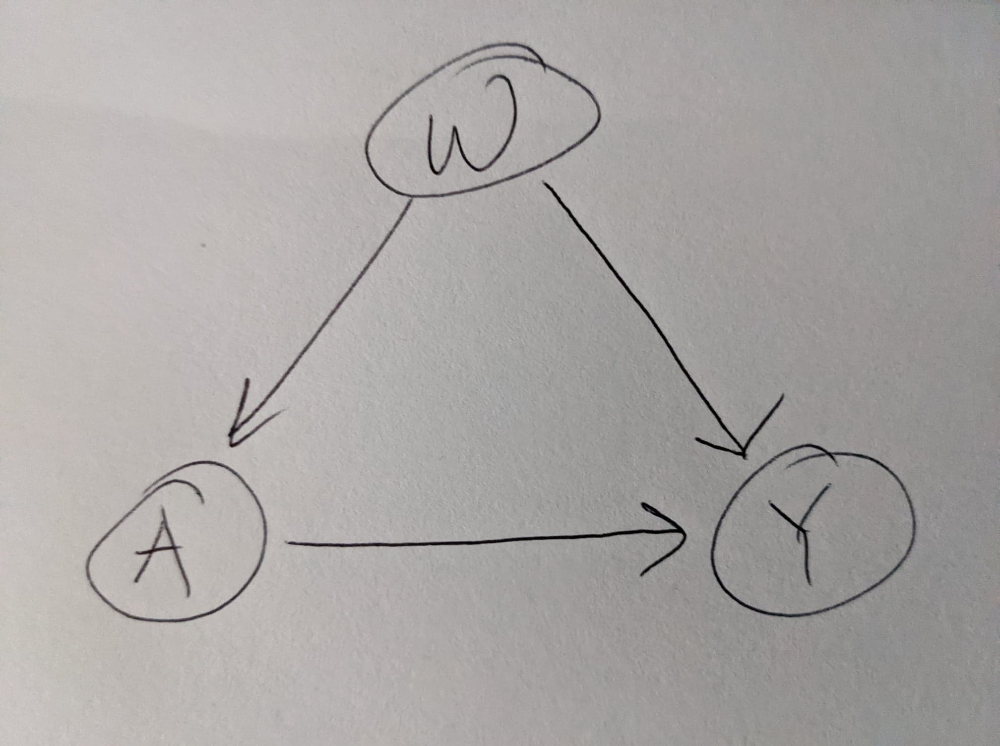

```{r message=FALSE, echo=FALSE}
# Install packages 
if (!require("pacman")) install.packages("pacman")

pacman::p_load(# Tidyverse packages including dplyr and ggplot2 
               tidyverse,
               dagitty,
               ggdag,
               AER, 
               # TinyTeX,  - if you do not have this library installed, document will not knit. Follow the instructions to install.
               modelsummary) # for creating summary tables ready for publication

# chunk options ----------------------------------------------------------------
knitr::opts_chunk$set(
  warning = FALSE            # prevents warning from appearing after code chunk
)

# set global theme for dags
theme_set(theme_dag())

# call helper function to make dags look nicher
source("pretty_dag.R")
```


# Causal Graph (DAG) Review

Let's briefly review what we know about directed acyclic graphs (DAGs) or causal graphs. In this lab, we will introduce the [daggity](http://www.dagitty.net/) and [ggdag](https://cran.r-project.org/web/packages/ggdag/vignettes/intro-to-ggdag.html#:~:text=Overview,from%20the%20tidyverse%2C%20like%20dplyr%20.) libraries for drawing DAGs in R.

Firstly, it is imperative that we keep in mind that DAGs are essentially a __visual representation of our *assumptions* about the causal relationships between variables__. We are rarely, if ever, able to prove that our DAG is actually "true"--we simply assume that it is. 

Therefore we must proceed with **\textcolor{red}{extreme caution}** when deciding upon the assumptions we wish to encode in our DAG (most assumptions are derived from knowledge within the field such as literature review, expert insight, etc.). And we must also take great care when interpreting any results from our statistical analysis, as they are only valid in the context of our DAG (and any other assumptions made).

The assumptions encoded in our DAG include (but are not limited to):

1. The variables included (and *not* included) in the DAG as a whole
2. Exclusion restriction(s) (defined below) 
3. Independence assumption(s) (defined below) 

## DAG Key Terms

Let's recall some key terms:

* **Endogenous** variables - Measured variables including exposure ($A$), outcome ($Y$), and any other measured covariates ($W$). Sometimes collectively referred to as $X$ (as in $X = \{W, A, Y\}$) or in other literatures as $S$.
* **Exogenous** variables - Unmeasured variables ($U_X$) which feed into the endogenous variables. Sometimes collectively referred to as $U$ (as in $U = \{U_W, U_A, U_Y\}$).
* **Exclusion restriction** - Note that this concept can be a bit confusing because it can to refer to two slightly different scenarios: 
- In the context of casual inference, can refer to the assumption that a particular arrow *does not* exist between two endogenous variables $X$. In other words, the absence of an arrow between any pair of endogenous variables is inherently an exclusion restriction--an assumption that *must be justified*.
- In the context of IVs, can refer to assumption that the only path by which $Z$ (instrument) affects $Y$ (outcome) is through $A$ (treatment). Meaning that $Z$ does not affect $Y$ through some other direct or indirect way.
* **Independence assumption** - Assumption regarding the joint distribution of the exogenous variables $U$. That is, the assumption that any pair of exogenous variables ($U_{X1}, U_{X2}$) are independent from each other ($U_{X1} \perp U_{X2}$) i.e. there is no arrow between them. In other words, the absence of an arrow between any pair of exogenous variables is inherently an independence assumption--an assumption that *must be justified*.
* **Unblocked backdoor path** - A causal path between the exposure ($A$) and the outcome ($Y$) (besides the direct "main effect" path of interest) which does not contain a collider. In other words, an indirect path which may explain some or all of the relationship between the exposure and outcome.
* **Collider** - A covariate $W$ with two parent nodes (two arrows pointed inward) on some backdoor path between the exposure ($A$) and the outcome ($Y$). The existence of a collider on a particular path "blocks" said path. NB: Conditioning on a collider induces a path between its two parents (thereby possibly inducing a *new* unblocked backdoor path).

**Example:** In the first DAG below, $W$ is a collider. In the second DAG, we have conditioned on $W$, thereby introducing a new path between $A$ and $Y$. Let's explore the example using `ggdag()`. This is not the easiest package to use, but [here](https://www.youtube.com/watch?v=uoAjyyToUTE) is a great tutorial you can use to get you started with the basics.

```{r out.width="50%", echo=FALSE}

# set seed
#set.seed(123)

# first DAG
# ----------
ex_dag1 <- dagify(Y ~ A,        # Y is caused by A
                  W ~ Y,        # W is caused by Y
                  W ~ A,        # W is caused by A
                  exposure = "A",     
                  outcome = "Y") %>%
  tidy_dagitty() %>%
  pretty_dag() 

ex_dag1 %>%
  ggdag() +                                                  # create dag object that can be modified with ggplot language 
  geom_dag_node(aes(color = color)) +                        # specify nodes be colored 
  geom_dag_text(col = "white") +                             # specify text be white
  theme(legend.position = "none") +                          # remove legend
  scale_color_manual(values=c("darkred","darkgrey", "navy")) # set colors

# second DAG
# ----------
ex_dag1 %>% 
  control_for(var = "W") %>%             # control for W
  ggdag_adjust() +                       # Adjust for variables and activate any biasing paths that result
  geom_dag_node(aes(color = adjusted)) +
  geom_dag_text(col = "white") 
```

## DAG Example Questions

Let's go through a few examples and answer a few questions about each DAG. Remember, we are interested in understanding the effect of exposure ($A$) on the outcome ($Y$).

**\textcolor{blue}{Question 1:}** Answer the following questions for the DAG above:

a. What are the endogenous variables?
b. What are the exogenous variables?
c. Are there any exclusion restrictions? If so, what are they?
d. Are there any independence assumptions? If so, what are they?
e. Are there any unblocked backdoor paths? If so, what is the path? (Note: There may be multiple paths)
f. Are there any colliders? If so, what are they? What path(s) do they block? What would happen if you were to condition on them?


```{r out.width="75%", echo=FALSE}
dagify(Y ~ A,
       Y ~ W1,
       A ~ W1,
       Y ~ U,
       A ~ U,
       W1 ~ U,
       exposure = "A",
       outcome = "Y") %>%
  tidy_dagitty() %>%
  pretty_dag() %>%
  ggdag() +
  geom_dag_edges() +
  geom_dag_node(aes(color = color)) +
  geom_dag_text(col = "white") +
  theme(legend.position = "none") +
  scale_color_manual(values=c("darkred", "lightgrey", "darkgrey", "navy"))
```


**Question 1 Solutions:**

a. $X = \{W_1, A, Y\}$
b. $U = \{U\}$
c. No.
d. No.
e. Yes two, $A \leftarrow W_1 \rightarrow Y$ and $A \leftarrow U \rightarrow Y$
f. No.


**\textcolor{blue}{Question 2:}** Answer the following questions for the DAG below:

a. What are the endogenous variables?
b. What are the exogenous variables?
c. Are there any exclusion restrictions? If so, what are they?
d. Are there any independence assumptions? If so, what are they?
e. Are there any unblocked backdoor paths? If so, what is the path? (Note: There may be multiple paths)
f. Are there any colliders? If so, what are they? What path(s) do they block? What would happen if you were to condition on them?


```{r out.width="75%", echo=FALSE}
dagify(Y ~ A,
       W1 ~ Y,
       W1 ~ A,
       Y ~ U_Y,
       A ~ U_A,
       W1 ~ U_W1,
       exposure = "A",
       outcome = "Y") %>%
  tidy_dagitty() %>%
  pretty_dag() %>%
  ggdag() +
  geom_dag_edges() +
  geom_dag_node(aes(color = color)) +
  geom_dag_text(col = "white") +
  theme(legend.position = "none") +
  scale_color_manual(values=c("darkred", "lightgrey", "darkgrey", "navy"))
```

**Question 2 Solutions:**

a. $X = \{W1, A, Y\}$
b. $U = \{U_{W1}, U_A, U_Y\}$
c. No.
d. Yes; $U_{W1} \perp U_A$, $U_{W1} \perp U_Y$, and $U_{A} \perp U_Y$
e. No. 
f. Yes; $W1$; $A \rightarrow W1 \leftarrow Y$; it would induce an unblocked backdoor path between $A$ and $Y$.


**\textcolor{blue}{Question 3:}** Answer the following questions for the DAG above:

a. What are the endogenous variables?
b. What are the exogenous variables?
c. Are there any exclusion restrictions? If so, what are they?
d. Are there any independence assumptions? If so, what are they?
e. Are there any unblocked backdoor paths? If so, what is the path? (Note: There may be multiple paths)
f. Are there any colliders? If so, what are they? What path(s) do they block? What would happen if you were to condition on them?

```{r out.width="75%", echo=FALSE}
dagify(Y ~ A,
       W1 ~ Y,
       W1 ~ A,
       W2 ~ W1,
       Y ~ W2,
       Y ~ U_Y,
       A ~ U_A,
       W1 ~ U_W1,
       W2 ~ U_W2,
       exposure = "A",
       outcome = "Y") %>%
  tidy_dagitty() %>%
  pretty_dag() %>%
  ggdag() +
  geom_dag_edges() +
  geom_dag_node(aes(color = color)) +
  geom_dag_text(col = "white") +
  theme(legend.position = "none") +
  scale_color_manual(values=c("darkred", "lightgrey", "darkgrey", "navy"))
```

**Question 3 Solutions:**

a. $X = \{W1, W2, A, Y\}$
b. $U = \{U_{W1}, U_{W2}, U_A, U_Y\}$
c. Yes; there is an assumption of no direct causal relationship between $W_2$ and $A$.
d. Yes; $U_{W1} \perp U_A$, $U_{W1} \perp U_Y$, $U_{W1} \perp U_{W2}$, $U_{W2} \perp U_{A}$, $U_{W2} \perp U_{Y}$, and $U_{A} \perp U_Y$
e. Yes; $A \rightarrow W1 \rightarrow W2 \rightarrow Y$.
f. Yes; $W1$; $A \rightarrow W1 \leftarrow Y$; it would induce an unblocked backdoor path between $A$ and $Y$.


# Instrumental Variables

## Instrumental Variables Rationale

Recall from our consideration of randomized experiments that, when implemented properly, randomizing the exposure allows us to ensure independence between the exposure and any other covariates. A simple DAG representing this situation when considering only the exposure $A$ and outcome $Y$ is shown below.

```{r out.width="75%", echo=FALSE}
dagify(Y ~ A,
       Y ~ U,
       Y ~ W,
       W ~ U,
       exposure = "A",
       outcome = "Y") %>%
  tidy_dagitty() %>%
  pretty_dag() %>%
  ggdag() +
  geom_dag_edges() +
  geom_dag_node(aes(color = color)) +
  geom_dag_text(col = "white") +
  theme(legend.position = "none") +
  scale_color_manual(values=c("darkred", "lightgrey", "darkgrey", "navy")) + 
  labs(title = "DAG of a randomized experiment")
```

This independence of $A$ from any measured covariates $W$ and from any unmeasured confounders $U$ is what allows us to make direct causal inferences on the effect of $A$ on $Y$ in random experiments.

As we have seen, however, observational data usually do not afford us the same freedom. Let us consider the DAG below.

```{r out.width="75%", echo=FALSE}
dagify(Y ~ A,
       Y ~ U,
       Y ~ W,
       W ~ U,
       A ~ U,
       A ~ W,
       exposure = "A",
       outcome = "Y") %>%
  tidy_dagitty() %>%
  pretty_dag() %>%
  ggdag() +
  geom_dag_edges() +
  geom_dag_node(aes(color = color)) +
  geom_dag_text(col = "white") +
  theme(legend.position = "none") +
  scale_color_manual(values=c("darkred", "lightgrey", "darkgrey", "navy")) +
  labs(title = "DAG of what you might see with observational data")
```
This simple DAG represents an unfortunately common situation in observational studies, in which the exposure $A$ and the outcome $Y$ are thought to have measured and unmeasured confounders in common.

We have explored many methods of accounting for *measured* confounders $W$, but what of *unmeasured* confounders $U$? We cannot control for a variable we cannot measure.

One strategy to combat this concern is to determine whether we might find some measurable covariate $Z$ which can "represent" the exposure $A$ but which, unlike $A$, *is independent from unmeasured confounders*. 

Such a covariate, if found, is called an **instrumental variable**.

## Instrumental Variable Criteria

While instrumental variables can be an exciting, clever "loophole" to the problem of exposure non-independence, they must be chosen with care.

In order for some variable $Z$ to be a valid instrument, it must be:

* Causally related to the exposure $A$. This can be represented in the DAG with an arrow $Z \rightarrow A$. This is commonly referred to as the **First Stage**.
* Exogenous to the system. That is, independent from (or **not** correlated with) the other covariates in the system *both* measured ($W$) and unmeasured ($U$). This can be represented in the DAG as the absence of arrows between $Z$ and the $W$s (a.k.a. exclusion restrictions) *and* the absence of arrows between unmeasured confounders of $Z$ ($U_Z$) and any other unmeasured confounders $U$ (a.k.a. independence assumptions). 
    * In other words, there should be no unblocked backdoor path from $Z$ to $Y$--**the only path from $Z$ to $Y$ must be that through $A$.** Confusingly, this criterion is commonly referred to simply as the **Exclusion Restriction**.

In the following DAG, $Z$ satisifies these requirements and is a valid instrument of the effect of $A$ on $Y$.

```{r out.width="75%", echo=FALSE}
dagify(Y ~ A,
       Y ~ U,
       Y ~ W,
       W ~ U,
       A ~ U,
       A ~ W,
       A ~ Z,   # introducing instrumental variable "Z" that causes treatment
       Z ~ U_Z, # instrumental variable Z that is caused by unobserved U_Z 
       exposure = "A",
       outcome = "Y") %>%
  tidy_dagitty() %>%
  pretty_dag() %>%
  ggdag() +
  geom_dag_edges() +
  geom_dag_node(aes(color = color)) +
  geom_dag_text(col = "white") +
  theme(legend.position = "none") +
  scale_color_manual(values=c("darkred", "lightgrey", "darkgrey", "navy", "darkgreen")) + 
  labs(title = "DAG of an instrumental variable analysis")
```

This second criteria has some inherent flexibility, however. In the case of a causal relationship between $Z$ and any *measured* confounders $W$, we can control for said confounders and still find this requirement satisfied. Consider the following DAG:

```{r out.width="75%", echo=FALSE}
ex_dag2 <- 
  dagify(Y ~ A,
         Y ~ U_YA,
         Y ~ W,
         W ~ U_W,
         A ~ U_YA,
         A ~ W,
         A ~ Z,
         W ~ Z,
         Z ~ U_Z,
         exposure = "A",
         outcome = "Y") %>%
  tidy_dagitty() %>%
  pretty_dag() 
ex_dag2 %>%
  ggdag() +
  geom_dag_edges() +
  geom_dag_node(aes(color = color)) +
  geom_dag_text(col = "white") +
  theme(legend.position = "none") +
  scale_color_manual(values=c("darkred", "lightgrey", "darkgrey", "navy", "darkgreen"))  + 
  labs(title = "DAG of an instrumental variable analysis with multiple paths of Z to Y")
```

The above DAG shows an unblocked backdoor path from $Z$ to $Y$ through $W$. However, if we control for $W$ we see this path disappear (Note: arrows are grey when adjusted for and can be ignored):

```{r echo=FALSE,warning=FALSE}
ex_dag2 %>% 
  control_for(var = "W") %>% # control for W
  ggdag_adjust() +
  geom_dag_node(aes(color = adjusted)) +
  theme(legend.position = "bottom",           # adjust to bottom to show Z --> A path  
        legend.text = element_text(size=7)) + # adjust legend theme size 
  geom_dag_text(col = "white") 
```

Now the only path from $Z$ to $Y$ is the direct path through $A$.

However, remember we must as always be cautious when adjusting for any covariates. In the previous example, we began with an independance assumption that $U_W \perp U_{YA}$.

Let us consider the following DAG *without* this independence assumption:

```{r out.width="75%", echo=FALSE}
ex_dag3 <- dagify(Y ~ A,
       Y ~ U,
       Y ~ W,
       W ~ U,
       A ~ U,
       A ~ W,
       A ~ Z,
       W ~ Z,
       Z ~ U_Z,
       exposure = "A",
       outcome = "Y") %>%
  tidy_dagitty() %>%
  pretty_dag() 
ex_dag3 %>%
  ggdag() +
  geom_dag_edges() +
  geom_dag_node(aes(color = color)) +
  geom_dag_text(col = "white") +
  theme(legend.position = "none") +
  scale_color_manual(values=c("darkred", "lightgrey", "darkgrey", "navy", "darkgreen"))
```

Note the only difference here is that $W$ shares unmeasured confounding $U$ with $A$ and $Y$. Now we again control for $W$:

```{r echo=FALSE,warning=FALSE}
ex_dag3 %>% 
  control_for(var = "W") %>%
  ggdag_adjust() +
  geom_dag_node(aes(color = adjusted)) +
  theme(legend.position = "bottom",           # adjust to bottom to show Z --> A path  
        legend.text = element_text(size=7)) + # adjust legend theme size 
  geom_dag_text(col = "white") 
```

Here we see that we still have an unblocked backdoor path from $Z$ to $Y$. **(Note that there should not be a relationship between $U_{Z}$ AND $U$ as a result of controlling for $W$---this is some issues with the package---only between $U$ AND $Z$.)**

**\textcolor{blue}{Question 4:}** What is the new unblocked backdoor path from $Z$ to $Y$? Why did controlling for $W$ open up this path?

**Solution:** $Z \rightarrow U \rightarrow Y$. $W$ is a collider of $Z$ and $U$ because it has two arrows going into it.

Recall that whenever we control for a covariate we must be on the lookout for colliders. Consider the following DAG:


```{r out.width="75%", echo=FALSE}
ex_dag4 <- 
  dagify(Y ~ A,
         Y ~ U_YA,
         W ~ Y,
         W ~ U_W,
         A ~ U_YA,
         A ~ W,
         A ~ Z,
         W ~ Z,
         Z ~ U_Z,
         exposure = "A",
         outcome = "Y") %>%
  tidy_dagitty() %>% 
  pretty_dag() 

ex_dag4 %>%
  ggdag() +
  geom_dag_edges() +
  geom_dag_node(aes(color = color)) +
  geom_dag_text(col = "white") +
  theme(legend.position = "none") +
  scale_color_manual(values=c("darkred", "lightgrey", "darkgrey", "navy", "darkgreen"))
```

Notice here that we again have the independence assumption $U_W \perp U_{YA}$, saving us from the problem just considered. However, $W$ itself is now a collider on the path from $Z$ to $Y$. 

**\textcolor{blue}{Question 5:}** Why is this a problem? What would happen if we controlled for $W$? Include a DAG in your answer.

**Solution:** Conditioning on $W$ will induce a path from $Z$ to $Y$ directly, which is therefore an unblocked backdoor path (of sorts) since it does not pass through $A$.

```{r out.width = "75%"}
## NOTE: The adjustment code is not working and seems to be an issue with how the package handles 
## controlling for colliders. 
#ex_dag4 %>% 
#  control_for(var = "W") %>%
#  ggdag_adjust() +
#  geom_dag_node(aes(color = adjusted)) +
#  geom_dag_text(col = "white") 

# Instead, you can use this as an opportunity to draw your DAG by hand and include a picture of it here
# Be sure to change "example-dag.jpg" below to the correct name of your file


```

# Two-Stage Least Squares (2SLS) Regression

In practice, instrumental variables are used most often in the context of linear regression models using Two-Stage Least Squares (2SLS) Regression.

Recall that a simple linear regression model looks as follows:

$$Y = \beta_0 + \beta_1A + \epsilon$$
Where the parameter coefficients $\beta_0$, $\beta_1$ represent the y-intercept and slope, respectively, and $\epsilon$ represents the error term.

Earlier we saw that a problem arises when $A$ and $Y$ have unmeasured confounders $U$ in common. This problem is diagnosed when considering the causal relationships represented in our DAG, but in practice is often discovered as a correlation between $A$ and the error term $\epsilon$.

## Exclusion Restriction

There is no empirical way to determine whether the "exclusion restriction" requirement discussed above (that the only causal path from $Z$ to $Y$ must be that through $A$) is met. You must use your knowledge of the system to develop what you believe to be an accurate DAG, and then determine whether your intended instrument satisfies this requirement based on that DAG. However, in practice, a variable $Z$ can be *ruled out* as a potential instrument if it appears correlated with $\epsilon$.

## First Stage 

The "first stage" requirement (that $Z$ must have a causal effect on $A$), however, can be empirically tested, and as the name implies, doing so is indeed the first stage in implementing an instrumental variable analysis. 

To do so, we simply regress the intended instrument $Z$ on the exposure $A$ (and any measured confounders $W$ that we have determined appropriate to control for) using a simple linear regression:

$$A = \beta_0 + \beta_1Z + \beta_2W + \epsilon$$
If this regression results in a high correlation value (the regression coefficent), $Z$ is considered a **strong** instrument and we may proceed. If value is low, however, $Z$ is considered a **weak** instrument and may be a poor choice of instrument.

If we decide to move forward with using $Z$ as an instrument, we save the predicted values of the treatment $\hat{A}$ that are a function of $Z$ and the covariance of $Z$ and $A$ ($Cov(Z,A)$) for the next stage.

**\textcolor{blue}{Question 6:}** Consider, what are some potential concerns with using a weak instrument?

**Solution:** There are many possible answers, but the primary concern is that $Z$ may not truly have a causal effect on $A$ (or at least, not a very strong one).

## Second Stage 

Now that we have the predicted values of the treatment $\hat{A}$, we regress the outcome $Y$ on these values (and any covariates included in the first stage), like so:

$$Y = \beta_0 + \beta_1\hat{A} + \beta_1W + \epsilon$$
We then retrieve the covariance between $Z$ and $Y$ ($Cov(Z,Y)$). The ratio between this and $Cov(Z,A)$ is then our 2SLS estimate of the coefficient on $A$ in the original model. *Note that this will differ slightly if you control for any $W$.*

$$\hat{\beta}_1 = \frac{Cov(Z,Y)}{Cov(Z,A)}$$

**\textcolor{blue}{Question 7:}** Explain in your own words why you think the above estimates the desired parameter.

> Your answer here.

# Natural Experiments

A common source of potential instrumental variables explored arise from natural experiments. A "natural experiment" refers to observational data in which randomization has been applied to an exposure (or instrumental) variable, but that randomization was *not* implemented by the researchers (i.e. it was implemented by "nature"). Common examples include legislative differences in similar jurisdictions (or legislative changes in a single jurisdiction, comparing shortly before and shortly after said change), proximity to a source the exposure of interest, and many others.

## Simulation

Let us consider a modified version of our AspiTyleCedrin example explored previously. In this version, say that both exposure to AspiTyleCedrin and the outcome of experiencing a migraine are affected by watching cable news, since AspiTyleCedrin are commonly shown on cable news channels, and stress from excessive cable news watching can trigger migraines. Say also that living near a pharmacy that carries AspiTyleCedrin makes people more likely to use it, but is not related to cable news watching or experience of migraines. Furthermore, say sex assigned at birth does have an effect on both AspiTyleCedrin use and experience of migraines, but is not causally related to either cable news watching or proximity to a pharmacy that sells AspiTyleCedrin.
(Note: This is just an example, in reality there may be reason to suspect causal relationships that we are not considering here).

Thus we have the following variables:

**Endogenous variables:**

* `A`: Treatment variable indicating whether the individual $i$ took AspiTyleCedrin ($A_i = 1$) or not ($A_i = 0$).
* `Y`: Continuous outcome variable indicating the number of migraines experienced by an individual in the past month. (NOTE: We have previously measured this variable as binary!)
* `W`: Variable representing sex assigned at birth, with $W = 0$ indicating AMAB (assigned male at birth), $W = 1$ indicating AFAB (assigned female at birth), and $W = 2$ indicating an X on the birth certificate, possibly representing an intersex individual or left blank.
* `Z`: Instrumental variable indicating proximity in miles the individual $i$ lives near a pharmacy that sells AspiTyleCedrin. 

**Exogenous variables:**

* `U_YA`: Unmeasured confounding variable, cable news watching, which affects the exposure $A$ and the outcome $Y$, 
* `U_Z`: Unmeasured confounding variable(s) which affect the instrument $Z$.

And our DAG is as follows:

```{r out.width="75%", echo=FALSE}
ex_dag5 <- 
  dagify(Y ~ A,
         Y ~ U_YA,
         Y ~ W,
         A ~ U_YA,
         A ~ W,
         A ~ Z,
         W ~ Z,
         Z ~ U_Z,
         exposure = "A",
         outcome = "Y") %>%
  tidy_dagitty() %>%
  pretty_dag() 

ex_dag5 %>%
  ggdag() +
  geom_dag_edges() +
  geom_dag_node(aes(color = color)) +
  geom_dag_text(col = "white") +
  theme(legend.position = "none") +
  scale_color_manual(values=c("darkred", "lightgrey", "darkgrey", "navy", "darkgreen"))
```

Simulate the dataset:

```{r}

# set seed for reproducibility 
set.seed(10)

n = 1e4 # Number of individuals (smaller than last time)

# NOTE: Again, don't worry too much about how we're creating this dataset, 
# this is just an example.

df <- data.frame(U_Z = rnorm(n, mean=50, sd=5),
                 U_YA = rbinom(n, size = 1, prob = 0.34),
                 W = sample(0:2, size = n, replace = TRUE, 
                             prob = c(0.49,0.50,0.01)),
                 eps = rnorm(n)
)
df <- df %>% 
  mutate(Z = 1.2*U_Z + 5,
         A = as.numeric(rbernoulli(n, 
                                   p = (0.03 + 0.06*(W > 0) + 0.7*(Z < 60) + 0.21*(U_YA == 1)))),
         Y = 5 - 4*A + 1*W + 3*U_YA) 
head(df)
summary(df)
```
**\textcolor{blue}{Question 8:}** Use the `lm()` function to regress whether the individual took AspiTyleCedrin ($A$) on proximity to a pharmacy that sells AspiTyleCedrin  $Z$ and sex assigned at birth $W$. Assign the predicted values to the variable name `A_hat`. Use the `cov()` function to find $Cov(Z,A)$ and assign the result to the variable name `cov_za`.

```{r}

# 1. first stage
# ----------
lm_out1 <- lm(A ~ Z + W,  # regress A (treatment) on Z (instrument) + W (covariates)
              data = df)  # specify data

# view model summary
summary(lm_out1)


# get fitted values (Z-hat)
A_hat <- lm_out1$fitted.values

# get the covariance of Z and A
cov_za <- cov(df$Z, df$A)
```

**\textcolor{blue}{Question 9:}** Use the `lm()` function to regress migraines $Y$ on your fitted values `A_hat`. Use the `cov()` function to find $Cov(Z,Y)$ and assign the result to the variable name `cov_zy`.

```{r}

# 2. reduced form 
# ----------
lm_out2 <- lm(Y ~ A_hat + W,  # regress Y (outcome) on fitted values from first stage
              data = df)  # specify data

# view model summary
summary(lm_out2)

# get the covariance of Z and Y
cov_zy <- cov(df$Z, df$Y)
```

**\textcolor{blue}{Question 10:}** Use your `cov_za` and `cov_zy` to estimate the coefficient $\beta_1$ in the following equation:

$$Y = \beta_0 + \beta_1\hat{A} + \beta_1W + \epsilon$$
Interpret your result in words.

```{r}

# 3. calculate treatment effect 
# ----------
beta_hat <- cov_zy/cov_za  # divide Cov(Z,Y) / Cov(Z,A)
beta_hat
```

> When controlling for sex assigned at birth, use of AspiTyleCedrin reduces migraines by approximately 3.8 per month. *Note this is slighlty different than the estimated coefficient in the OLS above, likely because the covariance of W was not included.*


The `AER` package also provides us with the `ivreg()` function which allows us to perform IV regression in one command (*note that the standard errors will correctly adjusted when using the `ivreg()` function*:


```{r}

# repeat using ivreg()
# ----------
lm_out3 <- ivreg(Y ~ A + W | W + Z , # reduced form (think of as norm OLS model) | controls + instrument (order doesn't matter)
                 data = df)          # specify data

# view model summary
summary(lm_out3)
```

**\textcolor{blue}{Question 11:}** Compare the estimate of the coefficient on $A$ in the output above to your previous answer.

> The results are identical. However, it should be noted that the output from mannualy plugging in the y-hats won't produce the correct standard errors. Instead, we should use `ivreg()` to get the correct standard errors, which are adjusted since the y-hats are "generated regressors" (generated from the data rather than measured independently of other variables).  

\newpage 

## Modelsummary

There are a number of packages that can help you quickly and easily format your results for a paper. My favorite is the `modelsummary()` library becuase it is so flexible, intuitive, and easily customizable---[check out the documentation](https://modelsummary.com/vignettes/get_started.html). I've given you some code to quickly compare you results with a basic OLS model and format the table for a paper, which is [based off this great tutorial](https://cran.r-project.org/web/packages/ivreg/vignettes/ivreg.html). 

```{r}

# you might need to (re)install tinytex() if not already. Follow instruction prompt
# tinytex::reinstall_tinytex(repository = "illinois")

# create a list of models
models <- list(
  "OLS" = lm(Y ~ A + W, data = df),  # since we didn't run an OLS above, we can specify it here
  "IV"  = lm_out3                    # specify the model output
)

# display table 
modelsummary(models,                                          # specify list of models
             title = 'OLS vs Instrumental Variable Analysis', # add title
             notes = "You can insert a footnote here."        # add notes and much more!
             )

```

\newpage 


# References

http://dx.doi.org/10.2139/ssrn.3135313

https://www.statisticshowto.com/instrumental-variable/

https://umanitoba.ca/faculties/health_sciences/medicine/units/chs/departmental_units/mchp/protocol/media/Instrumental_variables.pdf

https://rpubs.com/wsundstrom/t_ivreg

https://en.wikipedia.org/wiki/Instrumental_variables_estimation#Testing_the_exclusion_restriction 

https://towardsdatascience.com/a-beginners-guide-to-using-instrumental-variables-635fd5a1b35f

https://www.econometrics-with-r.org/12-1-TIVEWASRAASI.html